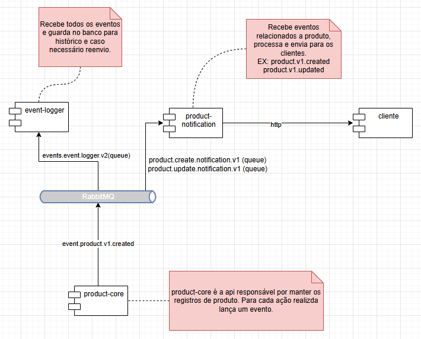

# POC - Event Bus with RabbitMQ

This project demonstrates the use of RabbitMQ as a messaging bus for asynchronous communication between Java/Spring Boot applications.

## Architecture



### Features:

- **Persistent Queues**: Configured to ensure message delivery in case of failures
- **Event-Driven Pattern**: Each service creates its own queue to consume specific events
- **Resilience**: System tolerant to application and infrastructure failures

## Environment Setup

### 1. Deploy RabbitMQ on Kubernetes

```bash
# Navigate to infrastructure directory
cd infra/rabbitmq

# Apply Kubernetes configurations
kubectl apply -f namespace.yaml
kubectl apply -f rabbitmq-secret.yaml
kubectl apply -f rabbitmq-config.yaml
kubectl apply -f rabbitmq-service.yaml
kubectl apply -f rabbitmq-statefulset.yaml

# Expose service locally
kubectl port-forward svc/rabbitmq -n rabbitmq 5672:5672
```

### 2. Application Initialization

Run the applications in the following order:

1. **Core Service**: `core/product`
2. **Event Logger**: `infra/event-logger`
3. **Notification Service**: `adapter/product-notification`

## Testing the Application

### Available Events

#### Update Product (product.v1.updated)

```bash
curl --location --request PUT 'localhost:8080/product' \
--header 'Content-Type: application/json' \
--data '{
    "name": "Premium Pan",
    "type": "Kitchen Utensil"
}'
```

#### Create Product (product.v1.created)

```bash
curl --location --request POST 'localhost:8080/product' \
--header 'Content-Type: application/json' \
--data '{
    "name": "Premium Pan",
    "type": "Kitchen Utensil"
}'
```

### Event Monitoring

Events can be monitored in the logs of the following applications:

- **Event Logger**: `infra/event-logger`
- **Product Notification**: `adapter/product-notification`

## Test Scenarios

### Resilience Tests Performed:

1. **Normal Scenario (Happy Path)**

   - ✅ Start all applications
   - ✅ Send messages via API
   - ✅ Verify reception in consumers

2. **Consumer Application Failure**

   - ✅ Stop one consumer
   - ✅ Send messages
   - ✅ Restart consumer
   - ✅ Verify processing of pending messages

3. **RabbitMQ Failure**
   - ✅ Stop consumer
   - ✅ Send messages
   - ✅ Stop RabbitMQ
   - ✅ Restart RabbitMQ
   - ✅ Restart consumers
   - ✅ Verify message integrity

**Result**: In all failure scenarios, events were successfully consumed by the applications.

## Considerations and Risks

### ⚠️ Points of Attention:

- **Topic Design**: Discipline required to create well-structured topics aligned with business rules
- **Storage Management**: Risk of disk space exhaustion if queues are not properly consumed
- **Monitoring**: RabbitMQ automatically monitors disk space and stops receiving messages when necessary

### 🚀 Observed Benefits:

- **Decoupling**: Independent and resilient services
- **Scalability**: Facilitates addition of new consumers
- **Reliability**: Delivery guarantee with persistence
- **Observability**: Centralized event logs

## Project Structure

```
poc_rabbitmq/
├── core/product/              # Main service (Publisher)
├── adapter/notification/      # Notification service (Consumer)
├── infra/
│   ├── event-logger/         # Event logger (Consumer)
│   └── rabbitmq/            # Kubernetes configurations
└── doc/                     # Documentation and diagrams
```
